# EventsMaster - Diagramma ER del Database

Database: `5cit_eventsMaster` (MySQL, charset utf8mb4)

## Diagramma

```mermaid
erDiagram

    Utenti {
        int id PK
        varchar Nome
        varchar Cognome
        varchar Email UK
        varchar Password
        enum ruolo "user | promoter | mod | admin"
        tinyint verificato
        blob Avatar
        datetime DataRegistrazione
        varchar reset_token
        datetime reset_token_expiry
        varchar email_verification_token
    }

    Locations {
        int id PK
        varchar Nome
        varchar Indirizzo
        varchar Citta
        varchar CAP
        varchar Regione
        int Capienza
    }

    Settori {
        int id PK
        varchar Nome
        varchar Fila
        int Posto
        int idLocation FK
        decimal MoltiplicatorePrezzo
        int PostiDisponibili
    }

    Manifestazioni {
        int id PK
        varchar Nome
        text Descrizione
        date DataInizio
        date DataFine
    }

    Eventi {
        int id PK
        varchar Nome
        date Data
        time OraI
        time OraF
        text Programma
        decimal PrezzoNoMod
        int idLocation FK
        int idManifestazione FK
        varchar Immagine
        enum Categoria "concerti | teatro | sport | comedy | cinema | famiglia"
    }

    Intrattenitore {
        int id PK
        varchar Nome
        varchar Categoria
    }

    Tipo {
        int id PK
        varchar nome
        decimal ModificatorePrezzo
    }

    Biglietti {
        int id PK
        varchar Nome
        varchar Cognome
        enum Sesso "M | F | Altro"
        int idEvento FK
        int idClasse FK
        enum Stato "carrello | acquistato | validato"
        int idUtente FK
        datetime DataCarrello
        varchar QRCode
    }

    Ordini {
        int id PK
        varchar MetodoPagamento
        datetime DataOrdine
        decimal Totale
    }

    Recensioni {
        int id PK
        int idEvento FK
        int idUtente FK
        int Voto "1-5"
        text Commento
        datetime created_at
    }

    Notifiche {
        int id PK
        varchar tipo
        int destinatario_id FK
        int mittente_id FK
        varchar oggetto
        text messaggio
        tinyint email_inviata
        tinyint letta
        json metadata
        datetime created_at
    }

    Evento_Intrattenitore {
        int idEvento FK
        int idIntrattenitore FK
        time OraI
        time OraF
    }

    EventiSettori {
        int idEvento FK
        int idSettore FK
    }

    Settore_Biglietti {
        int idBiglietto FK
        int idSettore FK
        varchar Fila
        int Numero
    }

    Ordine_Biglietti {
        int idOrdine FK
        int idBiglietto FK
    }

    Utente_Ordini {
        int idUtente FK
        int idOrdine FK
    }

    CreatoriEventi {
        int idUtente FK
        int idEvento FK
    }

    CreatoriLocations {
        int idUtente FK
        int idLocation FK
    }

    CreatoriManifestazioni {
        int idUtente FK
        int idManifestazione FK
    }

    CollaboratoriEventi {
        int id PK
        int idEvento FK
        int idUtente FK
        int invitato_da FK
        enum status "pending | accepted | declined"
        varchar token
        datetime created_at
        datetime updated_at
    }

    %% ---- RELAZIONI ----

    %% Location e Settori
    Locations ||--o{ Settori : "ha"

    %% Manifestazione e Eventi
    Manifestazioni ||--o{ Eventi : "raggruppa"

    %% Location e Eventi
    Locations ||--o{ Eventi : "ospita"

    %% Evento - Intrattenitori (M:N)
    Eventi ||--o{ Evento_Intrattenitore : ""
    Intrattenitore ||--o{ Evento_Intrattenitore : ""

    %% Evento - Settori (M:N)
    Eventi ||--o{ EventiSettori : ""
    Settori ||--o{ EventiSettori : ""

    %% Biglietti
    Eventi ||--o{ Biglietti : "venduto per"
    Tipo ||--o{ Biglietti : "classifica"
    Utenti ||--o{ Biglietti : "possiede"

    %% Biglietto - Settore (assegnazione posto)
    Biglietti ||--o| Settore_Biglietti : ""
    Settori ||--o{ Settore_Biglietti : ""

    %% Ordini - Biglietti (M:N)
    Ordini ||--o{ Ordine_Biglietti : ""
    Biglietti ||--o| Ordine_Biglietti : ""

    %% Utenti - Ordini (M:N)
    Utenti ||--o{ Utente_Ordini : ""
    Ordini ||--o| Utente_Ordini : ""

    %% Recensioni
    Utenti ||--o{ Recensioni : "scrive"
    Eventi ||--o{ Recensioni : "riceve"

    %% Notifiche
    Utenti ||--o{ Notifiche : "destinatario"

    %% Tracciamento creatori
    Utenti ||--o{ CreatoriEventi : "crea"
    Eventi ||--o{ CreatoriEventi : ""

    Utenti ||--o{ CreatoriLocations : "crea"
    Locations ||--o{ CreatoriLocations : ""

    Utenti ||--o{ CreatoriManifestazioni : "crea"
    Manifestazioni ||--o{ CreatoriManifestazioni : ""

    %% Collaborazioni
    Utenti ||--o{ CollaboratoriEventi : "collabora"
    Eventi ||--o{ CollaboratoriEventi : ""
```



## Tabelle principali

| Tabella | Descrizione |
|---|---|
| Utenti | Utenti registrati con ruolo (user, promoter, mod, admin), stato verifica e credenziali |
| Locations | Luoghi/venue dove si svolgono gli eventi, con indirizzo e capienza |
| Settori | Aree/settori di una location (es. Platea, Tribuna), con moltiplicatore prezzo e posti disponibili |
| Manifestazioni | Raggruppamenti di eventi (festival, tour, rassegne) con date inizio/fine |
| Eventi | Singolo evento con data, orari, prezzo base, categoria, immagine e riferimento a location e manifestazione |
| Intrattenitore | Artisti/performer con nome e categoria (mestiere) |
| Tipo | Tipologie di biglietto (Standard, VIP, Premium) con modificatore di prezzo |
| Biglietti | Biglietto singolo con intestatario, stato (carrello/acquistato/validato) e QR code |
| Ordini | Ordine di acquisto con metodo di pagamento, data e totale |
| Recensioni | Recensione utente su un evento con voto (1-5) e commento |
| Notifiche | Notifiche interne e email tra utenti |

## Tabelle ponte (relazioni M:N)

| Tabella | Collega | Descrizione |
|---|---|---|
| Evento_Intrattenitore | Eventi - Intrattenitore | Associa performer a eventi con orario esibizione (OraI, OraF) |
| EventiSettori | Eventi - Settori | Settori disponibili per un evento specifico |
| Settore_Biglietti | Biglietti - Settori | Assegnazione posto: fila e numero |
| Ordine_Biglietti | Ordini - Biglietti | Biglietti contenuti in un ordine |
| Utente_Ordini | Utenti - Ordini | Ordini effettuati da un utente |
| CreatoriEventi | Utenti - Eventi | Chi ha creato l'evento |
| CreatoriLocations | Utenti - Locations | Chi ha creato la location |
| CreatoriManifestazioni | Utenti - Manifestazioni | Chi ha creato la manifestazione |
| CollaboratoriEventi | Utenti - Eventi | Inviti a collaborare su un evento, con stato (pending/accepted/declined) e token |

## Calcolo prezzo biglietto

```
Prezzo finale = (Eventi.PrezzoNoMod + Tipo.ModificatorePrezzo) * Settori.MoltiplicatorePrezzo
```

- `PrezzoNoMod`: prezzo base dell'evento (senza modificatori)
- `ModificatorePrezzo`: sovrapprezzo del tipo biglietto (es. VIP +20)
- `MoltiplicatorePrezzo`: moltiplicatore del settore (es. Platea x1.5)

## Valori enum

| Campo | Valori |
|---|---|
| Utenti.ruolo | user, promoter, mod, admin |
| Biglietti.Stato | carrello, acquistato, validato |
| Biglietti.Sesso | M, F, Altro |
| Eventi.Categoria | concerti, teatro, sport, comedy, cinema, famiglia |
| CollaboratoriEventi.status | pending, accepted, declined |
