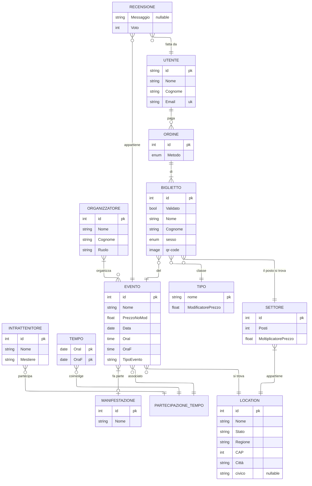

# Relazione Tecnica – Fase 1: Progettazione del Database

**EventsMaster:**  
**Studente: Bosco Mattia**  
**Classe: 5°C-IT**  
**Data:10/12/2025**  

---
---

## Indice
<!-- L’indice sarà generato automaticamente nel documento ODT/PDF -->

---
---

## Introduzione
<!-- Introduzione generale al progetto e agli obiettivi -->
il progetto è una web app per l'acquisto di biglietti

---
---

## Analisi dei Requisiti
<!-- Descrizione dei requisiti funzionali e non funzionali, attori, dati necessari, vincoli -->

---
---

## Il Database

### Diagramma ER



---
<!-- Schema relazionale logico  -->
### LO SCHEMA RELAZIONALE

---

>#### MANIFESTAZIONI

- id **PK**
- Nome

```md
manifestazione è caratterizzata da un identificatore univoco e da un nome, la manifestazione non è altro che un insieme di eventi.
```

>#### MANIFESTAZIONE_EVENTI

- *idManifestazione* (Manifestazione-->id)
- *idEvento* (Evento-->id)
- **PK(idManifestazione, idEvento)**

```md
tabella ausiliara che rappresenta il programma di una manifestazione.
```

>#### EVENTI

- id **PK**
- *idManifestazione* (Manifestazione-->id)
- *idlocation* (Location-->id)
- Nome
- PrezzoNoMod
- Data
- OraI
- OraF

```md
evento è caratterizzata da un identificatore univoco proprio e da quelli di manifestazione e location, oltra alle chiavi si vuole registrare il nome, la data in cui avviene con annesse ora di inizio e fine in modo da poter poi costruire il programma. in più all'evento è attribuito un prezzo di partenza che verrà poi modificato in base al settore scelto e dalla classe del biglietto.
```

>#### INTRATTENITORI

- id **PK**
- Nome
- Mestiere

```md
un intrattenitore può essere un singolo come un gruppo infatti nel campo nome ci va quello d'arte. l'attributo mestiere indica il tipo di intrattenitore: comico, cantante, mago,...
```

>#### TEMPI

- OraI **PK**
- OraF **PK**

```md
si usa l'entità tempi per non avere la stessa esibizione ripetuta in più fasce orarie
```

>#### ESIBIZIONI

- *idIntrattenitore* (Intrattenitore-->id)
- *idEvento* (Evento-->id)
- *OraI* (Tempo-->OraI)
- *OraF* (Tempo-->OraF)
- **PK(idEvento, idIntrattenitore, OraI, OraF)**

```md
un esibizione non è altro che la relazione tra una fascia oraria, un intrattenitore ed un evento.
```

>#### RECENSIONI

- *idEvento* (Evento-->id)
- *idUtente* (Utente-->id)
- Voto
- Messaggio ***NULLABLE***
- **PK(idEvento, IdUtente)**

```md
la recensione è identificata dall'utente che la fa e dall'evento che viene recensito, una recensione è composta inoltro da una valutazione (obbligatoria) e da un messaggio (opzionale).
```

>#### ORGANIZZATORI

- id **PK**
- Nome
- Cognome
- Ruolo

```md
l'organizzatore è caratterizzato da nome e cognome più il ruolo che ricopre nell'organizzazione dell'evento.
```

>#### ORGANIZZATORI_EVENTO

- *idEvento* (Evento-->id)
- *idOrganizzatore* (Organizzatore-->id)
- **PK(idEvento, idOrganizzatore)**

```md
tabella ausiliaria che rappresenta un evento con tutti gli organizzatori del caso o, nel caso contrario tutti gli eventi a cui un organizzatore ha lavorato
```

>#### LOCATIONS

- id **PK**
- Nome
- Indirizzo
  - Stato
  - Regione
  - CAP
  - Città
  - civico ***NULL***
  
```md
la location, identificata da un id univoco, è caratterizzata dal nome e dal luogo, il civico non è obbligatorio dato che non sempre c'è.
```

>#### SETTORI

- id **PK**
- *idLocation* (Location-->id)
- Posti
- MoltiplicatorePrezzo

```md
il settore è un'entità debole della location e ha con se il numero di posti e un moltiplicatore di prezzo per modificare il prezzo di partenza.
```

>#### BIGLIETTI

- id **PK**
- *idEvento* (Evento-->id)
- *idClasse* (Tipo-->id)
- Check
- Nome
- Cognome
- Sesso
- QR-code

```md
    il biglietto, identificato da un suo codice univoco più quello di evento e della classe dello stesso, ha inoltre come attributi nome e cognome della persona a appartiene, il sesso di questa persona e un qr-code che lo rappresenta digitalmente.
```

>#### SETTORE_BIGLIETTI

- *idSettore* (Settore-->id)
- *idBiglietto* (Biglietto-->id)
- Posto
  - Fila
  - Numero
- **PK(idSettore, idBiglietto)**

```md
tabella ausiliaria che permette di associare un biglietto ad un settore e definire quindi il posto associato al biglietto.
```

>#### ORDINI

- id **PK**
- Metodo

```md
l'ordine definisce il metodo di pagamento usato da un utente per pagare n biglietti
```

>#### ORDINE_BIGLIETTI

- *idOrdine* (Ordine-->id)
- *idBiglietto* (Biglietto-->id)
- **PK(idOrdine, idBiglietto)**

```md
tabella ausiliara che associa n biglietti ad un ordine.
```

>#### UTENTE

- id **PK**
- Nome
- Cognome
- Email **UK**

```md
l'utente è quello che ha fatto un ordine o una recensione, da non confondere da una persona, quest'ultima infatti non è un entità nel db ma più che altro un campo calcolato dal biglietto. l'utente oltre a nome cognome e id ha anche una mail associata in modo da poter essere aggiunto alla newsletter.
```

>#### UTENTE_ORDINI

- *idOrdine* (Ordine-->id)
- *idUtente* (Utente-->id)
- **PK(idOrdine, idUtente)**

```md
tabella ausiliaria che lega più ordini ad un utente
```

>#### TIPO

- nome **PK**,  
- ModificatorePrezzo

```md
tipo è la classe del biglietto (standard, ridotto, vip,...), infatti ha un modificatore di prezzo oltre al nome (id).
```

---
