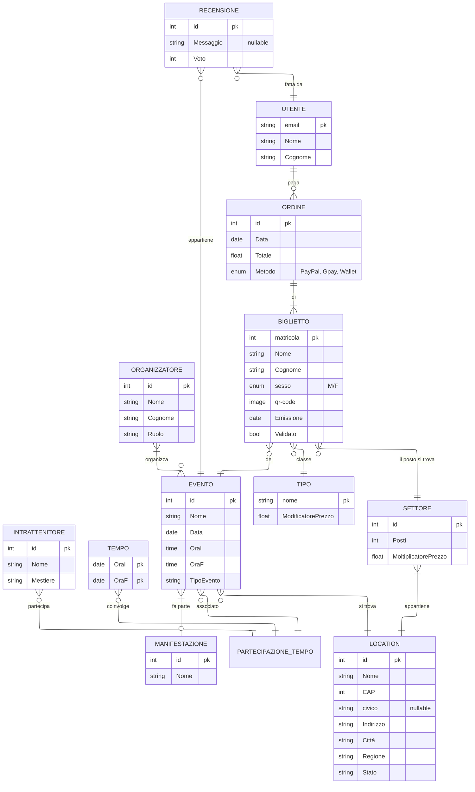

# Relazione Tecnica – Fase 1: Progettazione del Database

**EventsMaster:**  
**Studente: Bosco Mattia**  
**Classe: 5°C-IT**  
**Data:10/12/2025**  

---

## Indice
<!-- L’indice sarà generato automaticamente nel documento ODT/PDF -->

---

## Introduzione
<!-- Introduzione generale al progetto e agli obiettivi -->

---

## Analisi dei Requisiti
<!-- Descrizione dei requisiti funzionali e non funzionali, attori, dati necessari, vincoli -->

---

## Il Database

### Diagramma ER

---
<!-- Schema relazionale logico  -->
### Lo schema relazionale
<!--TODO: schema logico-->

#### MANIFESTAZIONE

**MANIFESTAZIONE**(  

- id **PK**,  
- Nome  
)

---

#### INTRATTENITORE

**INTRATTENITORE**(  

- id **PK**,  
- Nome,  
- Mestiere  
)

---

## RECENSIONE

**RECENSIONE**(  

- id **PK**,  
- Messaggio *(NULL)*,  
- Voto,  
- EventoID **FK → EVENTO(id)**,  
- UtenteEmail **FK → UTENTE(email)**  
)

---

## TEMPO

**TEMPO**(  

- OraI **PK**,  
- OraF **PK**  
)

---

## PARTECIPAZIONE_TEMPO  

(Relazione tripla EVENTO – INTRATTENITORE – TEMPO)

**PARTECIPAZIONE_TEMPO**(  

- EventoID **FK → EVENTO(id)**,  
- IntrattenitoreID **FK → INTRATTENITORE(id)**,  
- OraI **FK → TEMPO(OraI)**,  
- OraF **FK → TEMPO(OraF)**,  
- **PK(EventoID, IntrattenitoreID, OraI, OraF)**  
)

---

## EVENTO

**EVENTO**(  

- id **PK**,  
- Nome,  
- Data,  
- OraI,  
- OraF,  
- TipoEvento,  
- ManifestazioneID **FK → MANIFESTAZIONE(id)**,  
- LocationID **FK → LOCATION(id)**,  
- OrganizzatoreID **FK → ORGANIZZATORE(id)**  
)

---

## ORGANIZZATORE

**ORGANIZZATORE**(  

- id **PK**,  
- Nome,  
- Cognome,  
- Ruolo  
)

---

## LOCATION

**LOCATION**(  

- id **PK**,  
- Nome,  
- CAP,  
- civico *(NULL)*,  
- Indirizzo,  
- Città,  
- Regione,  
- Stato  
)

---

## BIGLIETTO

**BIGLIETTO**(  

- matricola **PK**,  
- Nome,  
- Cognome,  
- sesso **ENUM('M', 'F')**,  
- qr-code,  
- Emissione,  
- Validato,  
- EventoID **FK → EVENTO(id)**,  
- OrdineID **FK → ORDINE(id)**,  
- TipoNome **FK → TIPO(nome)**,  
- SettoreID **FK → SETTORE(id)**  
)

---

## TIPO

**TIPO**(  

- nome **PK**,  
- ModificatorePrezzo  
)

---

## SETTORE

**SETTORE**(  

- id **PK**,  
- Posti,  
- MoltiplicatorePrezzo,  
- LocationID **FK → LOCATION(id)**  
)

---

## ORDINE

**ORDINE**(  

- id **PK**,  
- Data,  
- Totale,  
- Metodo **ENUM('PayPal', 'Gpay', 'Wallet')**,  
- UtenteEmail **FK → UTENTE(email)**  
)

---

## UTENTE

**UTENTE**(  

- email **PK**,  
- Nome,  
- Cognome  
)
