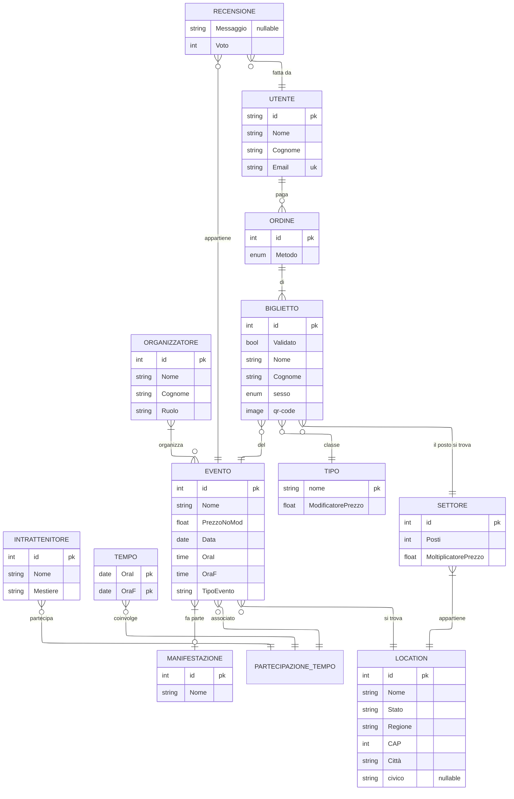

# Relazione Tecnica – Fase 1: Progettazione del Database

**EventsMaster:**  
**Studente: Bosco Mattia**  
**Classe: 5°C-IT**  
**Data:10/12/2025**  

---
---

## Indice
<!-- L’indice sarà generato automaticamente nel documento ODT/PDF -->

---
---

## Introduzione
<!-- Introduzione generale al progetto e agli obiettivi -->

---
---

## Analisi dei Requisiti
<!-- Descrizione dei requisiti funzionali e non funzionali, attori, dati necessari, vincoli -->

---
---

## Il Database

### Diagramma ER



---
<!-- Schema relazionale logico  -->
### LO SCHEMA RELAZIONALE

---

>#### MANIFESTAZIONI

- id **PK**
- Nome  

>#### MANIFESTAZIONE_EVENTI

- *idManifestazione* (Manifestazione-->id)
- *idEvento* (Evento-->id)
- **PK(idManifestazione, idEvento)**

>#### EVENTI

- id **PK**
- *idManifestazione* (Manifestazione-->id)
- *idlocation* (Location-->id)
- Nome
- PrezzoNoMod
- Data
- OraI
- OraF
- Programma

>#### INTRATTENITORI

- id **PK**
- Nome
- Mestiere

>#### TEMPI

- OraI **PK**
- OraF **PK**

>#### ESIBIZIONI

- *idIntrattenitore* (Intrattenitore-->id)
- *idEvento* (Evento-->id)
- *OraI* (Tempo-->OraI)
- *OraF* (Tempo-->OraF)
- **PK(idEvento, idIntrattenitore, OraI, OraF)**  

>#### RECENSIONI

- *idEvento* (Evento-->id)
- *idUtente* (Utente-->id)
- Voto
- Messaggio ***NULLABLE***
- **PK(idEvento, IdUtente)**

>#### ORGANIZZATORI

- id **PK**
- Nome
- Cognome
- Ruolo

>#### ORGANIZZATORI_EVENTO

- *idEvento* (Evento-->id)
- *idOrganizzatore* (Organizzatore-->id)
- **PK(idEvento, idOrganizzatore)**

>#### LOCATIONS

- id **PK**
- Nome
- Indirizzo
  - Stato
  - Regione
  - CAP
  - Città
  - civico ***NULL***

>#### SETTORI

- id **PK**
- *idLocation* (Location-->id)
- Posti
- MoltiplicatorePrezzo

>#### BIGLIETTI

- id **PK**
- *idEvento* (Evento-->id)
- *idClasse* (Tipo-->id)
- Check
- Nome
- Cognome
- Sesso
- QR-code

>#### SETTORE_BIGLIETTI

- *idSettore* (Settore-->id)
- *idBiglietto* (Biglietto-->id)
- Posto
  - Fila
  - Numero
- **PK(idSettore, idBiglietto)**

>#### ORDINI

- id **PK**
- Metodo

>#### ORDINE_BIGLIETTI

- *idOrdine* (Ordine-->id)
- *idBiglietto* (Biglietto-->id)
- **PK(idOrdine, idBiglietto)**

>#### UTENTE

- id **PK**
- Nome
- Cognome
- Email **UK**

>#### UTENTE_ORDINI

- *idOrdine* (Ordine-->id)
- *idUtente* (Utente-->id)
- **PK(idOrdine, idUtente)**

>#### TIPO

- nome **PK**,  
- ModificatorePrezzo

---

### SQL HIGHLIGHTS
<!-- TODO: inserire le parti da spiegare del DDL -->
```sql
    
```
